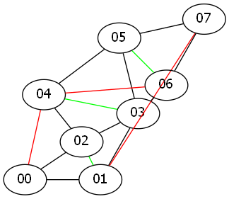
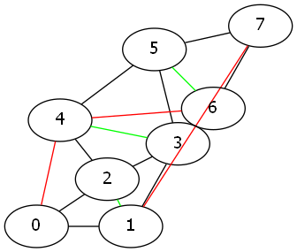
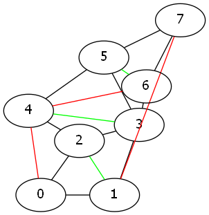
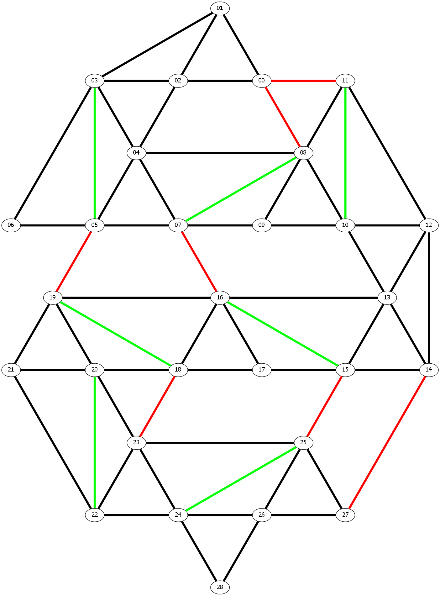
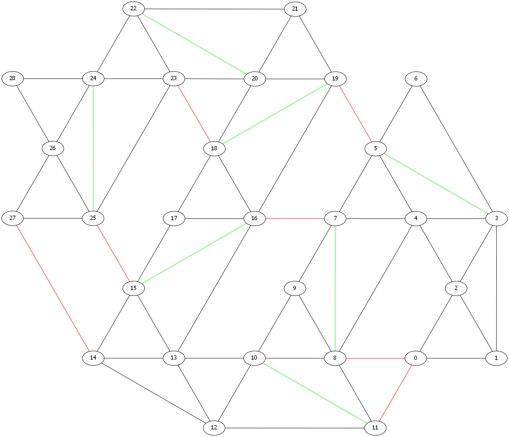
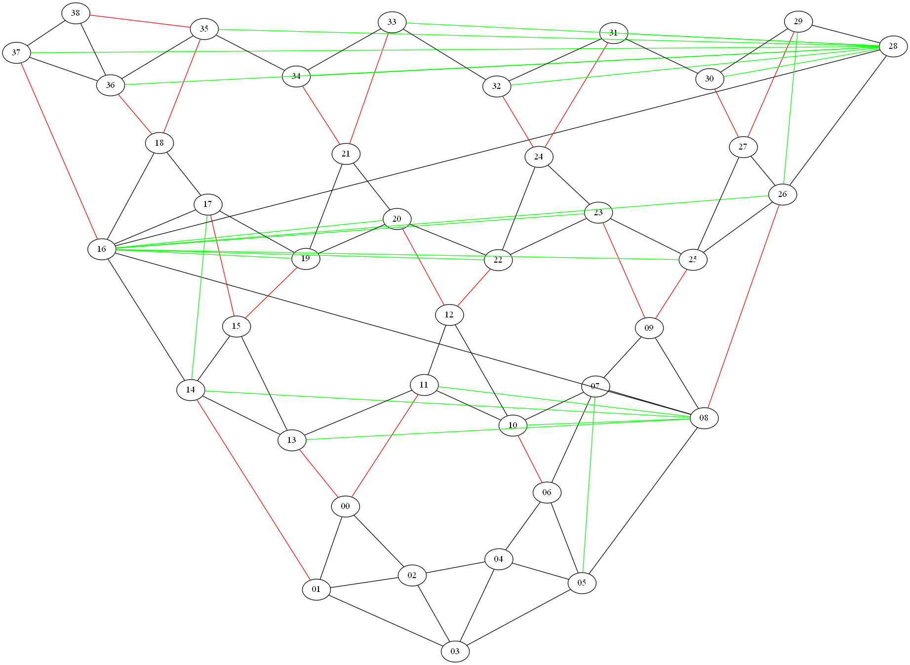
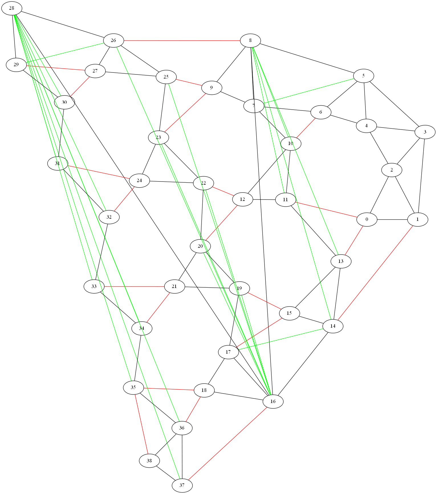

# DR-plan Solver

Takes a planar graph with edge distances that is minimally rigid in 2D and a flex DR-plan (a recursive decomposition into minimally 
rigid, maximal proper subgraphs) as input, and a desired flip (orientation) of a 2D realization of the vertices as points 
that achieves the edge distances. Outputs the realization.

## Requirements
* [**CMake**](https://cmake.org) >=3.5.*
* [**Boost Graph Library**](https://www.boost.org/doc/libs/release/libs/graph/)  
Use MinGW or [vcpkg](https://github.com/Microsoft/vcpkg) to integrate Boost with Windows.
* [**Splinter**](https://github.com/bgrimstad/splinter) for multi-variant interpolation.  
Header files are included in `./include/`.  
Download the latest version of splinter library [here](https://github.com/bgrimstad/splinter/releases).
* [**Boost Libraries**](https://www.boost.org/) for libraries like [Program Options](https://www.boost.org/doc/libs/release/libs/program_options/).
* [**GNU Linear Programming Kit (GLPK)**](https://www.gnu.org/software/glpk/) to solve the simplex of the cayley parameters.
* [**GraphViz**](https://www.graphviz.org/) (neato) to generate pictures from .dot files. (Optional)
<!-- * [**Cotire**](https://github.com/sakra/cotire) to generate pre-compiled header to speed up builds. (Included) -->

## Build
1. git clone this repository.  

2. Build  

    * Windows

        * Visual Studio
            1. Download the `msvc` version of Splinter library.
            2. Create a new folder to store the solution files.
            3. Use `cmake-gui` to generate Visual Studio project.  
            Manually specify the path to Splinter and GLPK in CMake. See the CMake options below.
            4. Open the project in Visual Studio and build.  

        * JetBrains CLion
            1. Download the `win-gcc` version of Splinter library.
            2. Directly open the `cmakelist.txt` as a project.
            3. Open **Settings -> Build, Execution, Deployment -> CMake**.
            4. Add CMake Options, see the CMake options below.

    * Linux  
        1. Download the linux version of Splinter library.  
        2. Use CMake to build.  
        ```
        cd build &&
        cmake .. -DCMAKE_BUILD_TYPE={Debug/Release} -DSPLINTER_LIB="Path/to/libsplinter-static-*-*.a" -DGLPK_LIB="Path/to/libglpk.so"
        ```  
        3. Make
        
3. CMake Options  
    * `-DSPLINTER_LIB=`
        * for static library, set to `Path/to/libsplinter-static-*-*.a`.
        * for shared library, set to `Path/to/libsplinter-*-*.so` on Linux and `Path/to/libsplinter-*-*.dll` on Windows.  
        Remeber to copy the shared library to the executable path.
    * `-DGLPK_LIB=`
        * for static library, set to `Path/to/libglpk.a`.
        * for shared library, set to `Path/to/libglpk.so` on Linux and `Path/to/libglpk.dll.a` on Windows.  
        Remeber to copy the shared library to the executable path.

## Usage

1. create a empty folder `exports` in the working directory to save outputs.  

2. `DRPLAN [options] <GraphViz>.dot`.  
`DRPLAN -h` for help message of options.  
```
    > DRPLAN -h
    Allowed options:
    --input-file arg        input file (.dot)
    -f [ --flip ] arg       vertex to be flipped (default: none)
    -s [ --sample ] arg     sample number (default: 20)
    -l [ --use-length ] arg whether use edge length from the input (default:
                            true).
    -h [ --help ]           produce help message
```

* Use `neato -n -Tpng -O <GraphViz>.dot` to generate PNG file.

    
## Examples

### HexTrig

1. __Input__  

2. __Run__  
`DRPLAN -f "3,5,6" -s 15 examples/hexTrig.dot`
3. __Solution__  



### Zig-Zag-7

1. __Input__  

2. __Run__
`DRPLAN -f "3,5,6,9,12,13,15,16,18,19,21,24,26,28" -s 25 examples/zig-zag-7.dot`
3. __Solution__  


### HexLattice

1. __Input__  

2. __Run__    
`DRPLAN -f "3,5,7,8,10,11,12,14,15,16,17,19,22,25,31,33,35,37,38" -s 50 examples/hexlattice-21.dot`
3. __Solution__  



## LICENSE
DRPLAN is free software: you can redistribute it and/or modify it under the
terms of the GNU General Public License as published by the Free Software
Foundation, either version 3 of the License, or (at your option) any later
version. See [LICENSE](./LICENSE) file for license rights and limitations
(GPL).
