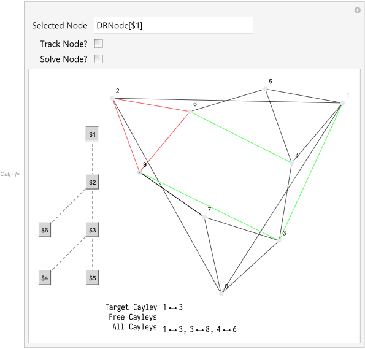
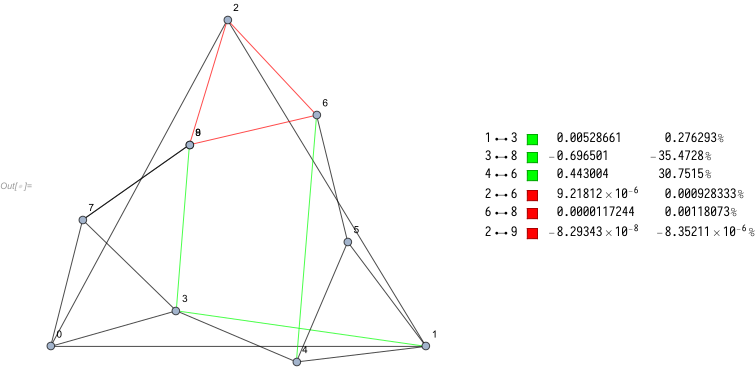
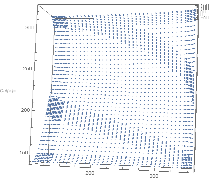
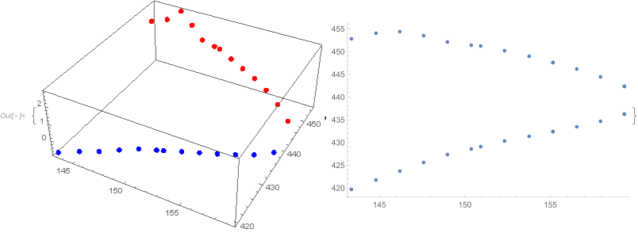
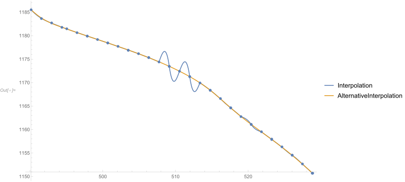
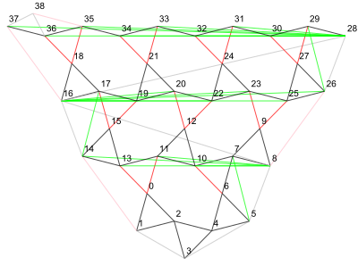
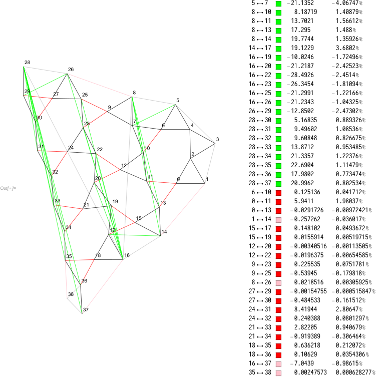

# Wolfram DR-Plan Package

## Introduction

This is a Wolfram Language implementation of the DR-Plan Solver originally
written in C++ (in the root folder) to provide better numerical precision and
demonstrative plots for research interests.

What it takes as input 
- a planar graph with edge distances that is minimally rigid in 2D,
- a flex DR-plan (a recursive decomposition into minimally rigid, maximal
proper subgraphs), and
- a desired flip (orientation) of a 2D realization of the vertices as points
that achieves the edge distances.

For output, it will search and return all the realization.


<!-- markdown-toc start - Don't edit this section. Run M-x markdown-toc-refresh-toc -->
**Table of Contents**

- [Wolfram DR-Plan Package](#wolfram-dr-plan-package)
    - [Introduction](#introduction)
    - [Requirements](#requirements)
    - [Usages](#usages)
        - [Solve A DR-Plan](#solve-a-dr-plan)
            - [Partial Results](#partial-results)
        - [Visualization](#visualization)
            - [Private variables for visualization](#private-variables-for-visualization)
        - [Offset Solver](#offset-solver)
        - [DFS Solver](#dfs-solver)
    - [Features](#features)
        - [Refined Sampling](#refined-sampling)
        - [Bead Threading](#bead-threading)
        - [Alternative Interpolation](#alternative-interpolation)
        - [Priority Search w/ Drop Offsets](#priority-search-w-drop-offsets)
    - [Flip Generalization](#flip-generalization)
    - [Results](#results)
        - [Input DR-Plan](#input-dr-plan)
        - [Output DR-Plan](#output-dr-plan)
    - [Roadmap](#roadmap)

<!-- markdown-toc end -->


## Requirements

- _Wolfram Mathematica_ (tested on 11.3)
- Submodules updated with:  
  `git submodule update --init --recursive`
- Several graphviz (.dot) files where
    - vertices ordered in two tree construction order;
    - vertices have initial positions;
    - edges ordered in two tree construction order,
    - edges has different colors representing different types
        - __black / gray:__ partial edge
        - __green:__ added edge (Cayley parameter)
        - __red / pink:__ dropped edge
    - see example graphs in root folder for reference


## Usages

### Solve A DR-Plan

Open a new notebook (.nb) in Mathematica, and paste the following code.
```Mathematica
(* import the code *)
<< "/path/to/DRPLAN/Wolfram/init.wls";
(* import the graph *)
exampleDRPlan = NewDRNode["/path/to/graphviz_file.dot"];
(* generate DR-Plan according to the graph *)
GenerateDRPlan[exampleDRPlan];
(* flip the clock-wise constructed vertices *)
FlipAt[exampleDRPlan, {3, 5, 7, 8}];
(* To see a preview of the DR-Plan *)
PrintDRPlan[exampleDRPlan]
(* To solve the DR-Plan *)
SolveDRPlan[exampleDRPlan]
```


#### Partial Results

To save the intermediate results from `SolveDRPlan`, you may access the solutions of
a particular node using downvalue, assign it to a variable and save it to a
file. To load it just load and assign it back to the downvalue. Remember to set
`"Reevaluate"` option to `False` (Default).

``` mathematica
(* Assume that the DRNode[$8] is already solved. *)
(* save to file *)
DRNode8Solutions = DRNode[$8]["Solutions"];
DumpSave["/path/to/solution.mx", DRNode8Solutions];

(* load from file *)
Get["/path/to/solution.mx"]
DRNode[$8]["Solutions"] = DRNode8Solutions;

SolveDRPlan[exampleDRPlan, "Reevaluate" -> False] (* leverage saved solutions *)

(* Or just run the following function as long as False is the default value for "Reevaluate". *)
SolveDRPlan[exampleDRPlan]
```

### Visualization

After you get the solution in `Association` form, use `AnalyzeSolution` to see the result graph.  
``` mathematica
AnalyzeSolution[exampleDRPlan, 
    <|54 -> 290.85, 53 -> 299.48, 55 -> 428.20, 56 -> 627.10, 57 -> 781.22, 58 -> 283.02, 59 -> 310.26, 60 -> 450.93, 61 -> 602.52, 62 -> 756.48, 63 -> 898.29, 64 -> 1037.55, 65 -> 263.81, 66 -> 283.26, 67 -> 425.22, 68 -> 605.50, 69 -> 762.23, 70 -> 908.12, 71 -> 1046.99, 72 -> 1190.59, 73 -> 1331.90|>
]

(* or *)

AnalyzeSolution[exampleDRPlan, #]& /@ exampleDRPlan["Solutions"]
```


#### Private variables for visualization
If you need to use the plot functions to plot the sample points, please enable
the `SowSampleList` option in `SolveNode`, so the sample points will be
collected in ``DRPLAN`Solver`Private`$sampleLists``.

### Offset Solver

You may also want to allow some offset for dropped edges, and perform a
priority search.
``` mathematica
(*
    Start searching for solutions by allow the length of
    the dropped edge multiplied by one of the given factors
*)
SolveAllOffsetsStart[exampleDRPlan, {1, 0.95, 1.05}]
```
After you get the result, you may continue your search for less
prioritized results.
``` mathematica
(* Continue the last search for the specified DR-Plan *)
SolveAllOffsetsContinue[exampleDRPlan]
```

There are some options you may want to specify:
  - "ConfigPath": the path to place options and intermediate status.
  - "StopAtSolution": whether to stop after a solution is found. You may
    continue to solve afterwards.
  - "AllCFlip": whether to search for cayley flips.
  
The results are stored in the `OffsetSolutions` downvalue use `ToPlanSolution`
to convert it.

``` mathematica
AnalyzeSolution[exampleDRPlan, ToPlanSolution[#]]& /@ exampleDRPlan["OffsetSolutions"]
```

### DFS Solver

Sometimes, DFS is preferred to the default BFS strategy used by

   `SolveNode`. Thus, you may want to call `DFSSolvingStart` and `DFSSolvingContinue`
   which resemble the machanism of Offset Solver.

``` mathematica
DFSSolvingStart[exampleDRPlan]
(* or *)
DFSSolvingContinue[exampleDRPlan]
```

There are some options you may want to specify:
  - "ConfigPath": the path to place options and intermediate status.
  - "StopAtSolution": whether to stop after a solution is found. You may
    continue to solve afterwards.
  - "AllCFlip": whether to search for cayley flips.
  
The results are stored in the `DFSSolutions` downvalue use `ToPlanSolution`
to convert it.

``` mathematica
AnalyzeSolution[exampleDRPlan, ToPlanSolution[#]]& /@ exampleDRPlan["DFSSolutions"]
```


## Features

There are several features which the original C++ program does not have and they are important and benefit the algorithm.

### Refined Sampling

For convenience, we divide the interval into many tiny segments. Each segment
has a index. If a sample point falls inside the segment, we put the Δ value into
the corresponding integer bin.

Efficiently stored in sparse array and easy to perform resampling and other
strategies. Because manipulating integers is much easier than manipulating
floats, for instance, we want to know whether this area has been sampled or not.
If we find an interval where its Δ value is near to zero, we apply the refined
sampling to that area. Effectively we insert more sample points into the index
bin.




These two plots are generated from `$sampleLists` using `ListPointPlot3D` and `ListContourPLot`.

``` mathematica
ListPointPlot3D[Flatten[Part[$sampleLists, 1], 1]]
ListContourPlot[Flatten[Part[$sampleLists, 1], 1], PlotLegends -> Automatic]
```

### Bead Threading

The zero points may belong to different flips of the dropped edge (which we call
D-Flips or dropped flips). We try to categorize them into different flips using
both the distance and derivatives information.



This plot is generated from `finalSamples` and `finalResults` in `SolveDFlip` using `Plot`.

``` mathematica
With[
    {
        zeros = SortBy[Flatten[MapThread[
            Outer[Prepend, #2, {#1}, 1, 1] &,
            {
                Select[finalSamples, Not@*MissingQ],
                Part[Select[finalResults, Not@*MissingQ], All, 1]
            }
        ], 2], First]
    },
    {
        ListPointPlot3D[zeros, ColorFunction -> Function[{x, y, z}, If[z > 0, Red, Blue]], ColorFunctionScaling -> False],
        ListPlot[Part[zeros, All, {1, 2}]]
    }
]
```


### Alternative Interpolation



To avoid artifacts in resampling, for example, non-uniform sample points may
result in fluctuation of the interpolation, if they are too close. Thus, we
interpolate them alternatively.


### Priority Search w/ Drop Offsets 

The motivation is to find a graph with multiple solution by several small offsets of the dropped edges.
For each time we solve the $c\_i^0$, we will simultaneously solve for $c\_i^(+5%)$ and $c\_i^(-5%)$.

We want the priority function to be

- **Look different**: the earlier the D-Flips diverse, the higher priority it has.

- **Solve quickly**: the longer whose D-Flips are, the higher priority it has.

- **Less offsets**: the less number of  dropped edges changed, the higher priority it has.

## Flip Generalization

Previously, specified the flip, we only take one solution from the quadratic
equation of constructing the two tree.

We may take both of them, and maintain different branches, the two-tree flip.
They are not all two-tree flips, only related to Cayley parameters Though they
may take exponential time.


## Results

Here is the results from a graph adapted from hexagonal lattice.
See `examples/hexlattice.zigzag-21.dot` in root folder.

### Input DR-Plan

 

### Output DR-Plan

 

## Compatibility

Unless otherwise commented in the code, here is the compatibility of some main
features:

| Feature                             | Chain DR-Plan | Flex-1 | Higher Flex |
| :-                                  | :-:           | :-:    | :-:         |
| Generate DR-Node                    | ✔             |        |             |
| Linear Programming                  | ✔             | ✔      | ✔           |
| $(c\_0, c\_i, d\_i)$ sampling       | ✔             | ✔      | ✔           |
| Refine sampling                     | ✔             | ✔      |             |
| Interpolation function root finding | ✔             | ✔      |             |
| Root threading                      | ✔             | ✔      |             |
| Offset solving: `notifyParent`      | ✔             | ✔      | ✔           |
| Offset solving: `ChainDiverseLevel` | ✔             |        |             |
| DFS solving                         | ✔             | ✔      | ✔           |

**Flex number** is the number of free variables at a DR-Node. **Flex-1** DR-Plan is
the DR-Plan where the maximum flex number of the nodes is 1.

**Chain DR-Plan** is a special flex-1 DR-Plan, where every node from root only has
two children, one of which is a Cayley parameter.
