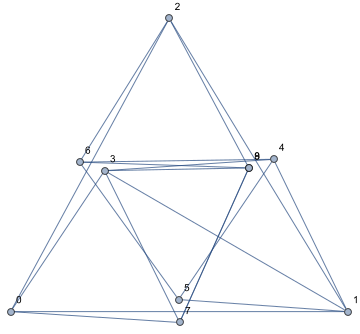

# CayMos and DR-Plan Solutions #

<!-- markdown-toc start - Don't edit this section. Run M-x markdown-toc-refresh-toc -->
**Table of Contents**

- [CayMos and DR-Plan Solutions](#caymos-and-dr-plan-solutions)
    - [Graph 1](#graph-1)
    - [Graph 2](#graph-2)

<!-- markdown-toc end -->

## Graph 1 ##

CayMos Dropped Edge: v7--v8

DR-Plan Dropped Edge: v2--v6, v6--v8, v2--v8

DR-Plan Added Edge: v1--v3, v3--v8, v4--v6

| No. | CayMos Flip | TwoTree Flip       | CayMos Graph                                                             | TwoTree Graph                                                                | Solved? (19/22) |
| :-- | :--         | :--                | :--                                                                      | :--                                                                          | :--             |
|   1 | {}          | {4, 6, 7, 8}       |       |  | Approx (1%)     |
|   2 | {}          | {4, 6, 7 ,8}       |       |  | Approx (1%)     |
|   3 | {4}         | {3, 4, 5}          |      |    |                 |
|   4 | {4}         | {3, 4, 5}          |      |    | Different       |
|   5 | {3, 4}      | {5, 6, 8}          |    |    |                 |
|   6 | {3, 4}      | {3, 5, 6}          |    |    |                 |
|   7 | {3, 4}      | {(3), 5, (6), (8)} |    |                                                                              | No              |
|   8 | {3, 4}      | {4, 5, (6), (8)}   |    |                                                                              | No              |
|   9 | {7}         | {3, 4, 6}          |      |    |                 |
|  10 | {7}         | {4, 6, 8}          |      |    |                 |
|  11 | {8}         | {4, 6, 7}          |      |    |                 |
|  12 | {8}         | {4, 6, 7}          |      |    |                 |
|  13 | {3, 4, 7}   | {4, 5, 7}          |  |    |                 |
|  14 | {3, 4, 7}   | {4, 5, 7}          |  |    |                 |
|  15 | {3, 4, 7}   | {5, 7}             |  |      |                 |
|  16 | {3, 4, 7}   | {5, 6, 7}          |  |    | No              |
|  17 | {3, 4, 7}   | {4, 5, 7, 8}       |  |  | Approx (1%)     |
|  18 | {3, 4, 7}   | {4, 5, 7}          |  |    |                 |
|  19 | {3, 4, 8}   | {3, 5, 6, 8}       |  |  | Approx (1%)     |
|  20 | {3, 4, 8}   | {5, 8}             |  |      | Approx (1%)     |
|  21 | {7, 8}      | {4, 6, 8}          |    |    |                 |
|  22 | {7, 8}      | {3, 4, 6, 8}       |    |  |                 |

## Graph 2 ##

CayMos Dropped Edge: v7--v8

DR-Plan Dropped Edge: v2--v6, v6--v8, v2--v8

DR-Plan Added Edge: v1--v3, v3--v8, v4--v6

| No. | CayMos Flip | TwoTree Flip | CayMos Graph                                                          | TwoTree Graph                                                                 | Solved?     |
| :-- | :--         | :--          | :--                                                                   | :--                                                                           | :--         |
|   1 | {}          | {3, 4, 5, 8} |   |  | Approx (2%) |
|   2 | {}          | {3, 4, 5, 8} |   |  |             |
|   3 | {3}         | {4, 5, 8}    |  |    | Approx (2%) |
|   4 | {3}         | {5, 8}       |  |      |             |
